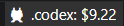
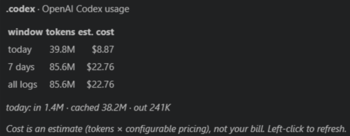

# Codex Multi-Account Usage

[English](README.md) · **한국어**

> **모든 OpenAI Codex 계정**의 토큰 사용량·예상 비용을 — VS Code 상태바에서.

[Claude Multi-Account Status Bar](https://github.com/southglory/claude-usage-bar)의
자매 확장입니다: 같은 아이디어를 **OpenAI Codex**용으로. 각 계정의 세션 로그를
로컬로 읽어(네트워크·자격증명 없음) 계정별 오늘 예상 지출을 보여줍니다.

**오늘 지출을 상태바에 바로** (숨쉬는 🦘 왈라비와 함께):



**호버하면 토큰·비용 — 오늘 / 7일 / 전체 로그:**



## 기능

- **N개 계정 나란히** — 목록을 비워두면 홈의 `.codex*` 폴더(각각 하나의 `CODEX_HOME`)를
  자동탐지. 라벨은 폴더명 그대로.
- **토큰 비용** — 오늘 / 7일 / 전체 로그의 토큰과 예상 비용을 호버 툴팁에, 오늘 지출은 상태바에.
- **로컬 & 프라이버시** — `<CODEX_HOME>/sessions/rollout-*.jsonl`의 토큰 수만 읽습니다.
  **API 호출 없음, `auth.json`/자격증명 접근 없음.**
- **숨쉬는 왈라비 마스코트** — 계정 앞의 작은 마스코트(원하면 끌 수 있음).

## 데이터 출처

계정별 사용량은 `<CODEX_HOME>/sessions/rollout-*.jsonl`에서 옵니다: `token_count`
이벤트(`total_token_usage`)를 날짜별로 합산합니다. 비용은 설정 가능한 100만 토큰당
단가로 클라이언트에서 계산합니다.

> **비용은 추정치**이지 실제 청구서가 아닙니다 — 정확한 토큰 수의 API 환산 값이에요.
> `codexUsage.pricing.*`를 현행 OpenAI 가격에 맞게 조정하세요.

> ℹ️ 로컬 세션 로그 기반이라 표시되는 수치는 **이 컴퓨터에서 한 작업 기준**입니다.
> 다른 기기에서 한 Codex 사용량은 합산되지 않습니다.

## 설정 (`settings.json`)

```jsonc
"codexUsage.accounts": [
  { "label": ".codex",      "dir": "~/.codex" },
  { "label": ".codex-work", "dir": "~/.codex-work" }
  // 비워두면 자동탐지
],
"codexUsage.refreshIntervalSeconds": 30,
"codexUsage.pricing.inputPerMillion": 1.25,
"codexUsage.pricing.cachedInputPerMillion": 0.125,
"codexUsage.pricing.outputPerMillion": 10
```

`dir`은 각 계정의 `CODEX_HOME`입니다(`~`, `%VAR%`, `${env:VAR}` 확장). 항목을
**좌클릭**하면 새로고침됩니다.

## 다계정 — Codex 방식

Codex는 **`CODEX_HOME`** 환경변수가 가리키는 폴더(기본 `~/.codex`)에서 설정·데이터를
읽습니다 — Claude Code의 `CLAUDE_CONFIG_DIR`와 똑같아요. `CODEX_HOME`을 다르게
(`~/.codex`, `~/.codex-work`, …) 주면 각각 별도 로그인이 되고, 이 확장이 전부 보여줍니다.

## 아직 없는 것

한도 %·주간 quota, API 호출, 풀 비용 대시보드는 현재 범위 밖입니다 — 지금은 로컬·비용만
다루는 집중된 첫 버전입니다.

## 라이선스

[MIT](LICENSE) © southglory. Codex는 OpenAI의 제품이며, 이 확장은 비공식·독립 도구입니다.
